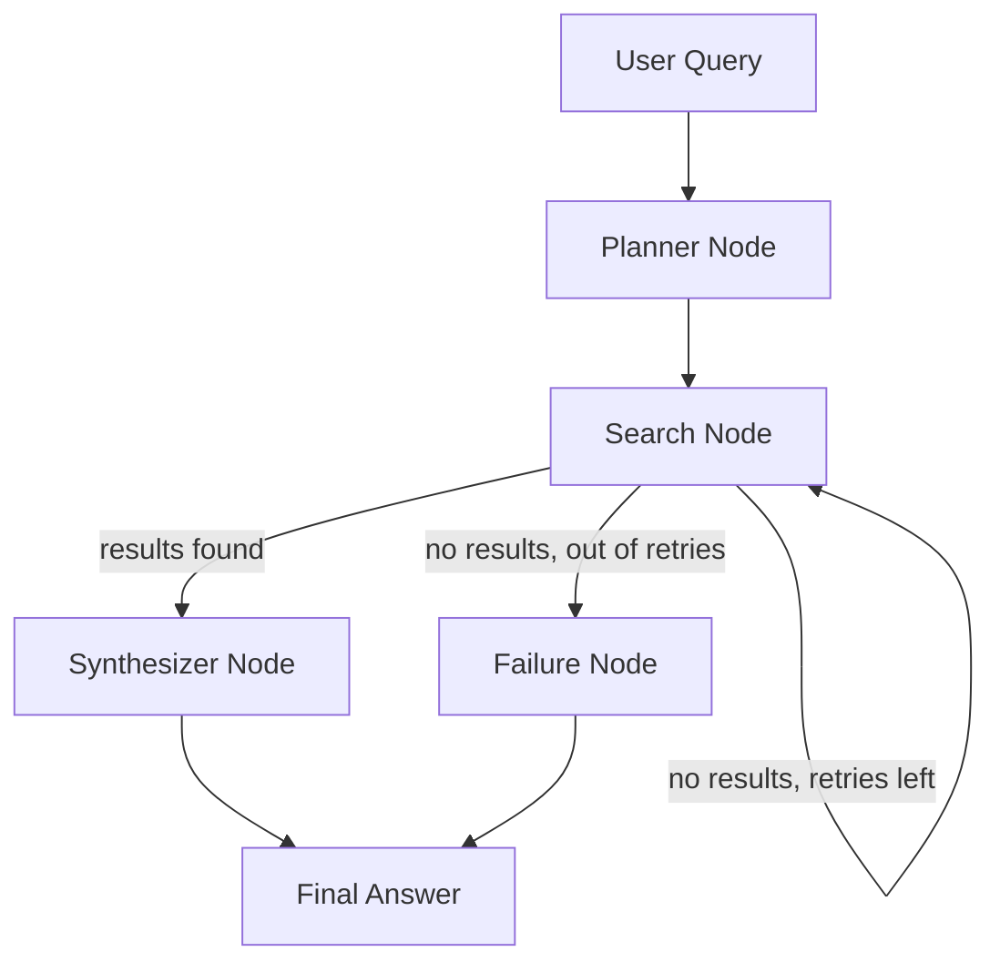

# LangGraph Research Agent

A multi-step AI research agent built with **LangGraph**. Give it a question, and it:

1. **Plans** — breaks your question into 2-3 focused sub-questions
2. **Searches** — runs each sub-question through the Tavily web search API
3. **Synthesizes** — combines all findings into one clear, sourced answer

Unlike a single-prompt chatbot call, this is an actual **graph** with conditional
routing: if the search step comes back empty, the agent automatically retries
(up to 2 times) before gracefully giving up — instead of silently returning a
bad answer.

## Architecture



**State object** (`state.py`) is the shared data structure passed between every
node — each node reads what it needs from it and writes back its results.

## Tech Stack

- **LangGraph** — graph orchestration and conditional routing
- **LangChain** — LLM wrapper
- **Groq (Llama 3.3 70B)** — the LLM (planning + synthesis), via free/fast Groq inference
- **Tavily API** — real-time web search
- **Streamlit** — optional demo UI
- **python-dotenv** — API key management

## Setup

1. Clone the repo and install dependencies:
   ```bash
   pip install -r requirements.txt
   ```

2. Copy `.env.example` to `.env` and add your API keys:
   ```bash
   cp .env.example .env
   ```
   - Get a free Groq key: https://console.groq.com/keys
   - Get a free Tavily key: https://tavily.com

3. Run it as a CLI:
   ```bash
   python main.py
   ```

   Or run the Streamlit demo UI:
   ```bash
   streamlit run app.py
   ```

## Project Structure

```
langgraph-research-agent/
├── state.py       # Shared AgentState definition
├── nodes.py        # Planner, Search, Synthesizer, Failure node logic
├── graph.py         # LangGraph wiring + conditional routing
├── main.py           # CLI entry point
├── app.py             # Streamlit UI entry point
├── requirements.txt
└── .env.example
```

## Why this project

Most "AI apps" are a single prompt-in, response-out API call. This project
demonstrates actual **agentic workflow design**: breaking a task into steps,
routing between them based on runtime conditions, and handling failure paths
gracefully — the core skill behind real AI Ops / agent-building roles.

## Possible extensions

- Add a "critic" node that checks if the synthesized answer actually addresses
  the original question before returning it
- Swap Tavily for a different tool (file search, database query, API call) to
  show the graph is tool-agnostic
- Add memory so follow-up questions build on previous research in the session
